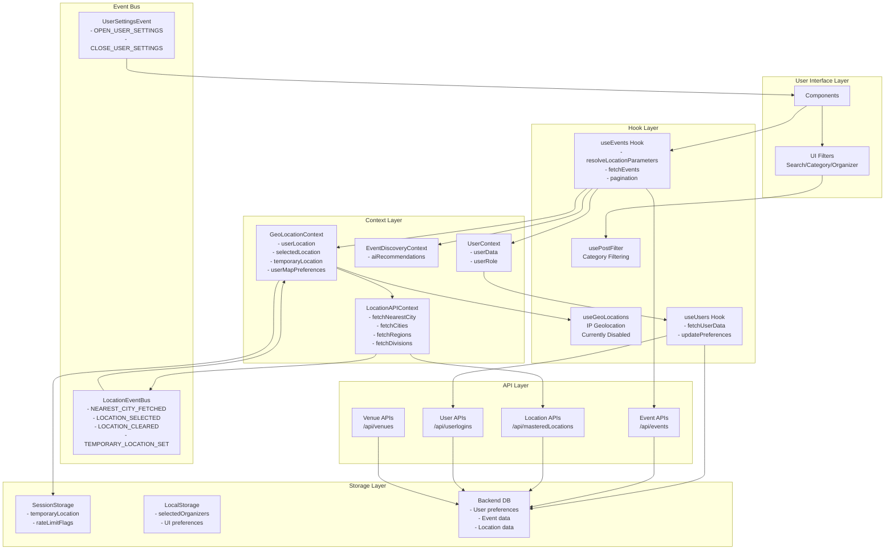
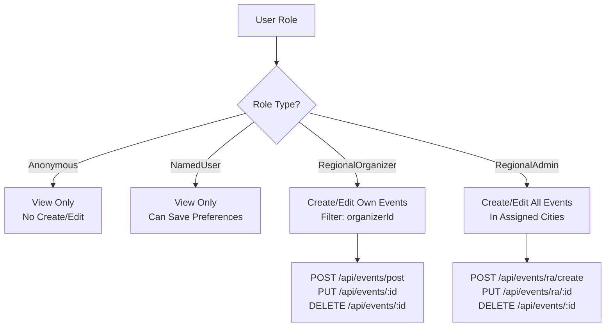
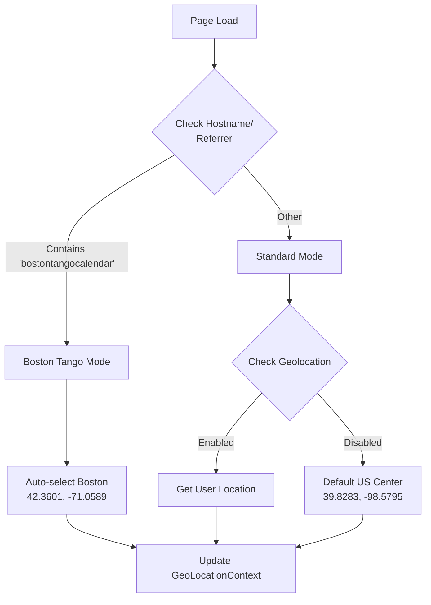

# Data Loading Architecture - TangoTiempo

## System Overview Diagram



## Location Resolution Priority Flow

```mermaid
graph TD
    Start[useEvents Hook Invoked] --> Check1{Explicit Params?<br/>region/division/city<br/>lat/lng}
    Check1 -->|Yes| UseExplicit[Use Explicit Parameters]
    Check1 -->|No| Check2{Temporary Location?<br/>Non-logged users}
    
    Check2 -->|Yes| UseTempLoc[Use Temporary Location<br/>From SessionStorage]
    Check2 -->|No| Check3{User Preferences?<br/>useLocationPreferences=true}
    
    Check3 -->|Yes| CheckMapMode{Map Mode?<br/>useCenterLocation}
    Check3 -->|No| Check4{Use GeoContext?<br/>useGeoLocationContext=true}
    
    CheckMapMode -->|Yes| UseMapCenter[Use Map Center<br/>defaultCenterLocation<br/>+ defaultZoomRange]
    CheckMapMode -->|No| UseMultiCity[Use Multi-City Mode<br/>masteredCityIds[]]
    
    Check4 -->|Yes| CheckSelected{Selected Location?}
    Check4 -->|No| NoLocation[No Location Filter<br/>Show All Events]
    
    CheckSelected -->|Yes| UseSelected[Use Selected Location]
    CheckSelected -->|No| CheckUserLoc{User Physical Location?}
    
    CheckUserLoc -->|Yes| UseUserLoc[Use Browser Location]
    CheckUserLoc -->|No| NoLocation
    
    UseExplicit --> BuildQuery[Build API Query]
    UseTempLoc --> BuildQuery
    UseMapCenter --> BuildQuery
    UseMultiCity --> BuildQuery
    UseSelected --> BuildQuery
    UseUserLoc --> BuildQuery
    NoLocation --> BuildQuery
    
    BuildQuery --> FetchAPI[Fetch Events from API]
```

## User Settings Data Flow

```mermaid
graph LR
    subgraph "User Settings Structure"
        UserData[userData]
        UserData --> LocalUserInfo[localUserInfo]
        LocalUserInfo --> UserDefaults[userDefaults]
        
        UserDefaults --> MapSettings[Map Settings<br/>- useCenterLocation<br/>- defaultCenterLocation<br/>- defaultZoomRange]
        UserDefaults --> CitySettings[City Settings<br/>- masteredCityIds[]<br/>- masteredRegionName<br/>- masteredDivisionName]
        UserDefaults --> AISettings[AI Settings<br/>- includeAiGenerated]
    end
    
    subgraph "Update Flow"
        UIModal[UserSettingsModal] --> UpdateAPI[PUT /api/userlogins/updateUserInfo]
        UpdateAPI --> Backend[Backend Database]
        Backend --> RefreshUser[Refresh User Data]
        RefreshUser --> UserContext[Update UserContext]
        UserContext --> TriggerRefetch[Trigger Event Refetch]
    end
```

## Role-Based Data Access



## Special Site Behaviors



## State Variables Reference

| Variable | Source | Purpose | Type |
|----------|--------|---------|------|
| **Location Variables** |
| effectiveRegion | resolveLocationParameters | Resolved region name | string |
| effectiveDivision | resolveLocationParameters | Resolved division name | string |
| effectiveCity | resolveLocationParameters | Resolved city name | string |
| effectiveLat | resolveLocationParameters | Resolved latitude | number |
| effectiveLng | resolveLocationParameters | Resolved longitude | number |
| effectiveCityIds | resolveLocationParameters | Array of city IDs | number[] |
| effectiveZoomRange | resolveLocationParameters | Search radius (miles) | number |
| **User Settings** |
| useCenterLocation | userDefaults | Map mode enabled | boolean |
| defaultCenterLocation | userDefaults | Map center coords | {lat, lng} |
| defaultZoomRange | userDefaults | Default radius | number |
| masteredCityIds | userDefaults | Selected cities | number[] |
| includeAiGenerated | userDefaults | Show AI events | boolean |
| **Context States** |
| userLocation | GeoLocationContext | Browser location | {lat, lng} |
| selectedLocation | GeoLocationContext | UI selected location | object |
| temporaryLocation | GeoLocationContext | Non-logged preferences | object |
| userMapPreferences | GeoLocationContext | Logged user map prefs | object |
| **Filters** |
| selectedCategories | EventCalendar | Active category filters | string[] |
| searchTerm | EventCalendar | Search query | string |
| selectedOrganizers | EventCalendar | Filtered organizers | string[] |
| includeAiGenerated | EventDiscoveryContext | AI events filter | boolean |

## API Parameter Mapping

```javascript
// Event API Parameters
{
  // Application Context
  appId: 1,  // TangoTiempo (2 = Boston Tango)
  
  // Pagination
  page: 1,
  limit: 100,
  
  // Date Range
  start: "2024-01-01T00:00:00Z",
  end: "2024-12-31T23:59:59Z",
  
  // Location Filters (Hierarchical)
  masteredRegionName: "North America",
  masteredDivisionName: "USA",
  masteredCityName: "Boston",
  cityIds: [123, 456],  // Multi-city mode
  
  // Geo Search (Map mode)
  lat: 42.3601,
  lng: -71.0589,
  radius: 50,  // miles
  sortByDistance: true,
  useGeoSearch: true,
  
  // Role Filters
  organizerId: "abc123",  // RegionalOrganizer only
  userRole: "RegionalOrganizer",
  
  // AI Filter
  includeAiGenerated: true
}
```

## Key Implementation Files

- **Hooks**
  - `/src/app/hooks/useEvents.js` - Main event fetching logic
  - `/src/app/hooks/useGeoLocations.js` - IP geolocation (disabled)
  - `/src/app/hooks/useUsers.js` - User data management
  - `/src/app/hooks/usePostFilter.js` - Client-side filtering

- **Contexts**
  - `/src/app/contexts/GeoLocationContext.js` - Location state
  - `/src/app/contexts/LocationAPIContext.js` - Location APIs
  - `/src/app/contexts/EventDiscoveryContext.js` - AI filtering
  - `/src/app/contexts/UserContext.js` - User authentication

- **Components**
  - `/src/app/components/Modals/UserSettings/UserSettingsModal.js` - Settings UI
  - `/src/app/components/Events/EventCalendar.js` - Main calendar
  - `/src/app/components/UI/LocationSelector.js` - Location picker
  - `/src/app/components/Maps/MapComponent.js` - Map interface

- **Utils**
  - `/src/app/utils/EventAPI.js` - Event API calls
  - `/src/app/utils/LocationEventBus.js` - Event bus implementation
  - `/src/app/utils/UserSettingsEvent.js` - Settings modal events