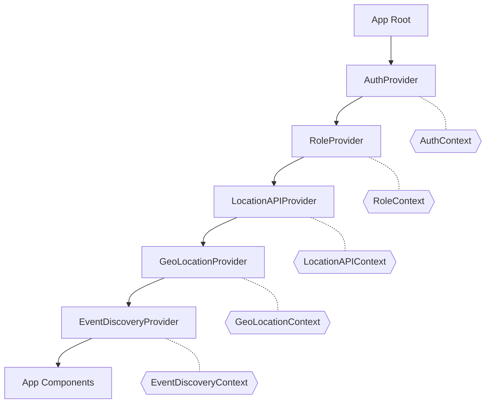
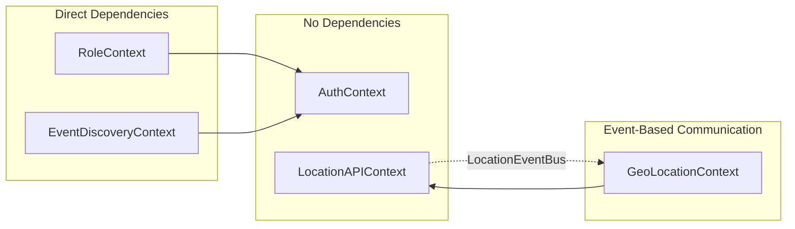

# React Context Architecture

## Context Hierarchy Diagram



## Context Dependencies & Event Flow



## Detailed Context Functions & State

### 1. AuthContext
**Purpose**: Authentication and user management
**Location**: `/app/contexts/AuthContext.js`

#### State Variables:
- `user` - Firebase user object merged with backend data
- `selectedRole` - Currently selected user role
- `loading` - Auth loading state
- `error` - Auth error messages

#### Functions:
- `authenticateWithGoogle()` - Google OAuth login
- `authenticateWithFacebook()` - Facebook OAuth login
- `authenticateWithApple()` - Apple OAuth login
- `login(email, password)` - Email/password login
- `signUp({email, password, firstName, lastName})` - Create new account
- `logOut()` - Sign out user
- `getIdToken(forceRefresh)` - Get fresh auth token
- `resetPassword(email)` - Send password reset email
- `sendVerificationEmail()` - Send email verification

#### Sets/Updates:
- User authentication state
- User roles from backend
- Auth tokens (refreshed every 30min)
- Selected role (defaults to 'NamedUser')

---

### 2. RoleContext
**Purpose**: Role selection and management
**Location**: `/app/contexts/RoleContext.js`

#### State Variables:
- `roles` - Array of available user roles
- `selectedRole` - Currently selected role (synced with AuthContext)

#### Functions:
- `selectRole(role)` - Change active user role

#### Sets/Updates:
- Available roles from user object
- Selected role synchronization

---

### 3. LocationAPIContext
**Purpose**: Pure API layer for location data fetching
**Location**: `/app/contexts/LocationAPIContext.js`

#### State Variables:
- `loading` - API request loading state
- `error` - API error messages

#### Functions:
- `fetchNearestCity(latitude, longitude, maxDistance)` - Get nearest city from coordinates
- `fetchCities(divisionId, isActive, requireCoordinates)` - Get cities list
- `fetchRegions(countryId, isActive)` - Get regions list
- `fetchDivisions(regionId, isActive)` - Get divisions list

#### Events Emitted (via LocationEventBus):
- `NEAREST_CITY_FETCHED` - City data retrieved
- `CITIES_FETCHED` - Cities list retrieved
- `REGIONS_FETCHED` - Regions list retrieved
- `DIVISIONS_FETCHED` - Divisions list retrieved
- `LOCATION_ERROR` - Location operation failed
- `API_ERROR` - API request failed
- `LOADING_STARTED` - Request initiated
- `LOADING_COMPLETED` - Request finished

---

### 4. GeoLocationContext
**Purpose**: Location state management and user location
**Location**: `/app/contexts/GeoLocationContext.js`

#### State Variables:
```javascript
userLocation: {
  latitude: null,
  longitude: null,
  accuracy: null,
  lastUpdated: null
}

selectedLocation: {
  country: { id: null, name: null },
  region: { id: null, name: null },
  division: { id: null, name: null },
  city: { id: null, name: null, latitude: null, longitude: null }
}

locationData: {
  cities: [],
  regions: [],
  divisions: []
}

loadingState: {
  userLocation: false,
  locationData: false,
  nearestCity: false
}

errorState: {
  userLocation: null,
  locationData: null,
  nearestCity: null
}
```

#### Functions:
- `selectLocation(location)` - Manually select a location
- `clearLocation()` - Clear selected location
- `fetchNearestCity(lat, lng, maxDist)` - Proxy to LocationAPI
- `refreshUserLocation()` - Get browser geolocation
- `fetchCities()` - Proxy to LocationAPI
- `fetchRegions()` - Proxy to LocationAPI
- `fetchDivisions()` - Proxy to LocationAPI

#### Computed Values:
- `locationDisplayText` - Display string for selected location
- `isLoading` - Combined loading state
- `isInitialized` - Context ready state

#### Event Subscriptions:
- Listens to all LocationEventBus events
- Updates state based on API results

---

### 5. EventDiscoveryContext
**Purpose**: Event filtering and user preferences
**Location**: `/app/contexts/EventDiscoveryContext.js`

#### State Variables:
```javascript
{
  locationMode: 'map',
  selectedCityIds: [],
  filters: {
    categories: [],
    venues: [],
    organizers: [],
    searchTerm: '',
    aiRecommendations: false
  },
  preferences: null,
  hasUnsavedChanges: false,
  isLoadingPreferences: false,
  isSavingPreferences: false,
  preferencesError: null
}
```

#### Functions:
- `setLocationMode(mode)` - Switch between map/list views
- `setSelectedCities(cityIds)` - Update selected cities
- `setFilters(filters)` - Update search filters
- `resetFilters()` - Clear all filters
- `savePreferences()` - Save to backend (auto-saves after 2s)
- `loadPreferences()` - Load from user data

#### Features:
- Auto-save with 2-second debounce
- Syncs with user backend data
- Preserves filter state across sessions

#### Custom Hooks:
- `useEventFilters()` - Access filter state
- `useLocationMode()` - Access location mode
- `useHasUnsavedChanges()` - Check save status
- `usePreferencesState()` - Access preference loading state

---

## Data Flow Examples

### 1. User Location Flow
```
Browser Geolocation → GeoLocationContext.refreshUserLocation()
  → LocationAPIContext.fetchNearestCity()
  → API Call
  → LocationEventBus.emit(NEAREST_CITY_FETCHED)
  → GeoLocationContext updates selectedLocation
```

### 2. Authentication Flow
```
User Login → AuthContext.authenticateWithGoogle()
  → Firebase Auth
  → Backend User Creation/Fetch
  → Merge Firebase + Backend Data
  → Update user state
  → RoleContext updates available roles
```

### 3. Event Filter Flow
```
User Updates Filter → EventDiscoveryContext.setFilters()
  → hasUnsavedChanges = true
  → 2-second debounce timer
  → Auto-save to backend via updateUserData()
  → Update user preferences
```

## Key Architecture Decisions

1. **Event-Based Decoupling**: LocationAPIContext and GeoLocationContext communicate via events to prevent circular dependencies

2. **State Separation**: 
   - API layer (LocationAPIContext) has minimal state
   - State management (GeoLocationContext) subscribes to API events
   
3. **Auto-Save Pattern**: EventDiscoveryContext uses debounced auto-save for better UX

4. **Token Management**: AuthContext refreshes tokens every 30 minutes automatically

5. **Role Synchronization**: RoleContext keeps selectedRole in sync with AuthContext

6. **Preference Persistence**: Event filters saved to user backend automatically

## Context Usage Patterns

```javascript
// Using multiple contexts in a component
import { useAuth } from '@/contexts/AuthContext';
import { useGeoLocation } from '@/contexts/GeoLocationContext';
import { useEventFilters } from '@/contexts/EventDiscoveryContext';

function MyComponent() {
  const { user, selectedRole } = useAuth();
  const { selectedLocation, refreshUserLocation } = useGeoLocation();
  const { filters, setFilters } = useEventFilters();
  
  // Component logic...
}
```

## Performance Considerations

1. **Context Split**: Each context serves a specific purpose to minimize re-renders
2. **Event Bus**: Decouples API calls from state updates
3. **Memoization**: Context values are memoized where appropriate
4. **Lazy Loading**: Contexts only fetch data when needed
5. **Debouncing**: Auto-save operations are debounced to reduce API calls