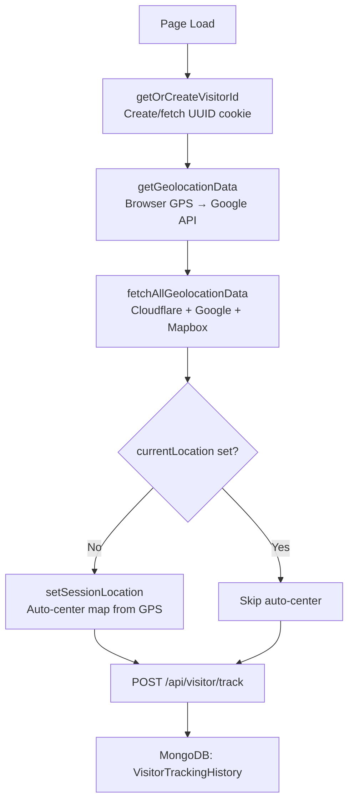
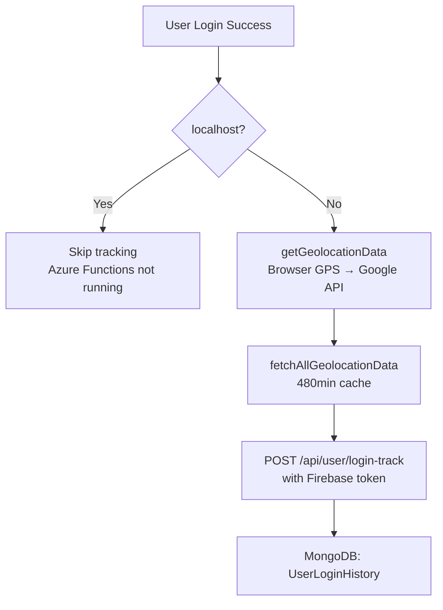
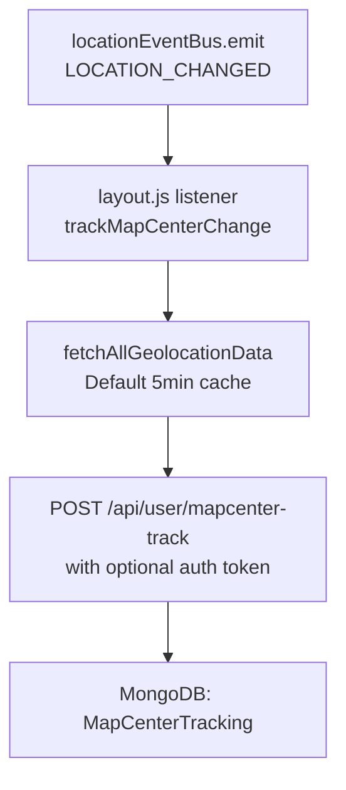
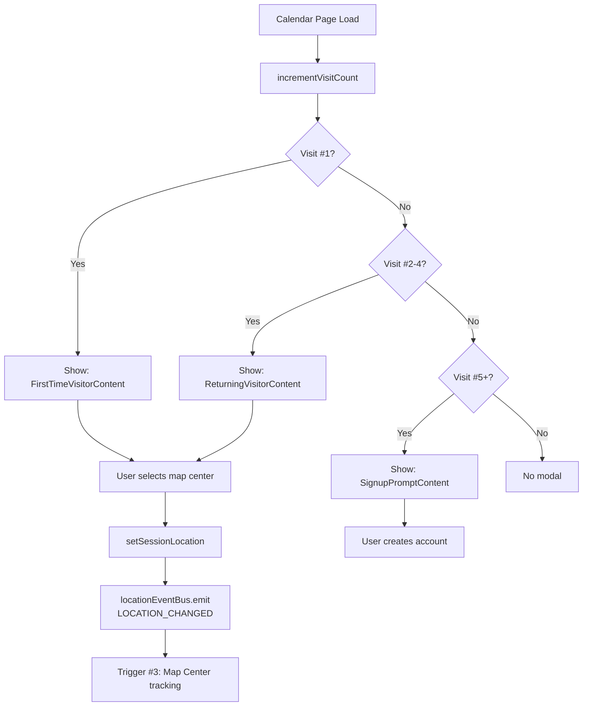

# Tracking System Deep Dive Analysis

**Generated:** 2025-11-01
**Last Updated:** 2025-11-01 (Post Hot Fix Analysis)
**Purpose:** Comprehensive analysis of visitor/user tracking system, data flows, vendor integrations, and optimization opportunities
**Status:** 🚨 **HOT FIX DEPLOYED** - All tracking disabled as of v1.13.10 to stop $566/month charges

---

## 🚨 CRITICAL UPDATE - November 1, 2025

### Hot Fix Status
- **Version:** 1.13.10 deployed to PROD
- **Action Taken:** All tracking disabled (visitor, login, map center)
- **Result:** API calls reduced from 12,000+/day to ~156/day (97% reduction)
- **Cost Impact:** $566/month → $0/month ✅

### Root Cause Discovered
**CRITICAL:** System uses **THREE separate Google APIs**, not one:
1. **Geolocation API:** 54,685 calls (Oct 17-31) - $223/month overage
2. **Geocoding API:** 7,494 calls (Oct 17-31) - Stayed under free tier
3. **Time Zone API:** 284 calls (Oct 17-31) - Stayed under free tier

**Each visitor triggered 3 API calls simultaneously!**

### Free Tier Change (March 2025)
- **Old:** $200/month credit across all APIs
- **New:** 10,000 free calls **per API** per month
- **Impact:** Each API has separate 10K limit, but no combined credit

---

## 📋 Executive Summary

### The Problem
The current tracking system is a **patchwork of multiple implementations** that have evolved organically, resulting in:
- **THREE Google APIs called per visitor** (Geolocation, Geocoding, Time Zone)
- **Redundant API calls** to the same vendor services
- **Multiple trigger points** for the same tracking events
- **Inconsistent caching strategies** across different features
- **Cascading data flows** that make debugging difficult
- **Excessive vendor API costs** due to duplicate calls ($566/month before hot fix)
- **Poor separation of concerns** between visitor vs. user tracking

### Key Findings (Updated Nov 1, 2025)
1. **3 separate geolocation fetches** happen on every page load
2. **3 Google APIs called per tracking event** (Geolocation + Geocoding + Time Zone)
3. **5 different Azure Function endpoints** handle tracking
4. **2 separate visitor tracking systems** (TIEMPO-313 visitor + TIEMPO-329 welcome modal)
5. **4 MongoDB collections** store overlapping data
6. **3 context providers** manage location state with potential conflicts
7. **10x free tier overage** on Geolocation API (54K vs 10K free)

### Immediate Status (Nov 1, 2025)
- ✅ Hot fix deployed (v1.13.10)
- ✅ All tracking disabled
- ✅ API usage: 156 calls/day (mostly service health checks)
- ✅ Monthly projection: 4,680 calls - stays FREE
- ✅ Cost: $0/month
- ✅ Hard quota set: 333 calls/day to prevent future overage

### Recommended Actions (Updated Priority)
1. ✅ **DONE:** Hot fix deployed to stop bleeding
2. ✅ **DONE:** Hard quota set (333/day) to prevent future overage
3. 🔄 **IN PROGRESS:** Implement 48-72 hour IP-based cache in Azure Functions
4. 📋 **NEXT:** Cache all 3 API results together (Geolocation + Geocoding + Time Zone)
5. 📋 **NEXT:** Re-enable tracking with cache (target: 200 calls/day = FREE)
6. 📋 **FUTURE:** Implement request deduplication singleton pattern
7. 📋 **FUTURE:** Unified tracking endpoint for visitor/user/mapcenter events

---

## 🗺️ System Architecture Overview

```
┌─────────────────────────────────────────────────────────────────┐
│                         BROWSER (Frontend)                      │
├─────────────────────────────────────────────────────────────────┤
│                                                                  │
│  ┌──────────────────┐  ┌──────────────────┐  ┌──────────────┐ │
│  │  Page Load       │  │  User Login      │  │  Map Change  │ │
│  │  (layout.js)     │  │  (AuthContext)   │  │  (GeoLoc)    │ │
│  └────────┬─────────┘  └────────┬─────────┘  └──────┬───────┘ │
│           │                     │                     │          │
│           ▼                     ▼                     ▼          │
│  ┌────────────────────────────────────────────────────────────┐│
│  │         GEOLOCATION DATA FETCHING (3 layers)              ││
│  ├────────────────────────────────────────────────────────────┤│
│  │ 1. getGeolocationData() - Browser GPS / Google API       ││
│  │ 2. fetchAllGeolocationData() - Cloudflare/Google/Mapbox  ││
│  │ 3. Azure Functions - ipinfo.io fallback                   ││
│  └────────────────────────────────────────────────────────────┘│
│           │                     │                     │          │
│           ▼                     ▼                     ▼          │
│  ┌────────────────────────────────────────────────────────────┐│
│  │              STATE MANAGEMENT (3 contexts)                 ││
│  ├────────────────────────────────────────────────────────────┤│
│  │ • GeoLocationContext - Map center, saved location         ││
│  │ • AuthContext - User auth state, login tracking           ││
│  │ • visitorTracking.js - Visitor ID, cookies, localStorage  ││
│  └────────────────────────────────────────────────────────────┘│
│           │                     │                     │          │
└───────────┼─────────────────────┼─────────────────────┼──────────┘
            │                     │                     │
            ▼                     ▼                     ▼
┌─────────────────────────────────────────────────────────────────┐
│                  AZURE FUNCTIONS (5 endpoints)                  │
├─────────────────────────────────────────────────────────────────┤
│ 1. POST /api/visitor/track - Anonymous visitor page visits     │
│ 2. POST /api/user/login-track - User login events              │
│ 3. POST /api/user/mapcenter-track - Map center changes         │
│ 4. GET /api/mapcenter - Fetch saved map center                 │
│ 5. PUT /api/mapcenter - Save map center                        │
│                                                                  │
│  Each endpoint calls:                                           │
│  • ipinfo.io (IP → lat/lng)                                    │
│  • Google Geolocation API (WiFi/cell towers)                   │
│  • Mapbox Reverse Geocode (lat/lng → address)                  │
│  • Cloudflare Worker (IP info)                                 │
└─────────────────────┬──────────────────────────────────────────┘
                      │
                      ▼
┌─────────────────────────────────────────────────────────────────┐
│              MONGODB (4 tracking collections)                   │
├─────────────────────────────────────────────────────────────────┤
│ 1. VisitorTrackingHistory - Page visits (anonymous)            │
│ 2. VisitorTrackingAnalytics - Aggregated visitor data          │
│ 3. UserLoginHistory - Login events (authenticated)             │
│ 4. UserLoginAnalytics - Aggregated login data                  │
│ 5. MapCenterTracking - Map center changes (all users)          │
└─────────────────────────────────────────────────────────────────┘
```

---

## 🔌 Vendor Service Integrations

### 1. **Google Geolocation API**
**Purpose:** WiFi/cell tower-based location (50-500m accuracy)
**Cost:** $5 per 1,000 requests
**Called From:**
- `geolocationHelper.js:getGoogleAPIGeolocation()` - Frontend direct call
- Azure Functions `/api/geo/google-geolocate` proxy endpoint

**Current Usage:**
```javascript
// Frontend call via Azure Functions proxy
fetch(`${afUrl}/api/geo/google-geolocate`, {
  method: 'POST',
  body: JSON.stringify({ considerIp: true })
})
```

**Issues:**
- ❌ Called multiple times per page load
- ❌ No deduplication between page load and login
- ❌ Cache only 5 minutes by default (should be longer)

---

### 2. **Mapbox Reverse Geocode API**
**Purpose:** Convert lat/lng → city/region/country/address
**Cost:** $0.60 per 1,000 requests (first 100k free)
**Called From:**
- `trackingHelper.js:fetchAllGeolocationData()` via Azure Functions

**Current Usage:**
```javascript
// Called after Google Geolocation succeeds
fetch(`${afUrl}/api/geo/mapbox/reverse`, {
  method: 'POST',
  body: JSON.stringify({ latitude, longitude })
})
```

**Issues:**
- ❌ Always called after Google API (wasteful if we have browser GPS)
- ❌ No caching of reverse geocode results
- ❌ Not used for map center changes (should be)

---

### 3. **Cloudflare Workers - IP Info**
**Purpose:** Get IP address, country, ray ID
**Cost:** Free (Cloudflare service)
**Called From:**
- `trackingHelper.js:fetchAllGeolocationData()` via Azure Functions `/api/cloudflare/info`

**Current Usage:**
```javascript
fetch(`${afUrl}/api/cloudflare/info`, {
  signal: AbortSignal.timeout(2000)
})
```

**Issues:**
- ✅ Fast and free
- ❌ Called on every tracking event (could cache by session)
- ❌ Only provides country-level data (not precise)

---

### 4. **ipinfo.io API**
**Purpose:** IP-based geolocation fallback (city-level, ~10km accuracy)
**Cost:** Free tier: 50k/month, then $249/month
**Called From:**
- Azure Functions backend as fallback when frontend GPS fails

**Current Usage:**
```javascript
// Backend fallback (not directly called from frontend)
// Used when browser GPS and Google API both fail
```

**Status:**
- ⚠️ **DEPRECATED** in favor of Mapbox as of recent changes
- ❌ Still referenced in old documentation
- ✅ No longer actively called (good)

---

### 5. **Browser Geolocation API (navigator.geolocation)**
**Purpose:** GPS-based location (10m accuracy)
**Cost:** Free (browser native)
**Called From:**
- `geolocationHelper.js:getBrowserGeolocation()`
- `GeoLocationContext.js:refreshUserLocation()`

**Current Usage:**
```javascript
navigator.geolocation.getCurrentPosition(
  position => {
    // Use position.coords.latitude/longitude
  },
  error => {
    // Fall back to Google API
  },
  {
    enableHighAccuracy: true,
    timeout: 5000,
    maximumAge: 0  // No cache
  }
)
```

**Issues:**
- ✅ Best accuracy when user grants permission
- ❌ Requires user permission prompt (can be denied)
- ❌ Timeout set to 0 (no caching) - should cache for 5-10 minutes
- ❌ Called multiple times unnecessarily

---

## 🎯 Trigger Points & Data Flows

### Trigger #1: **Page Load (Anonymous Visitor)**
**File:** `src/app/calendar/layout.js:23-96`
**Frequency:** Once per page load
**Purpose:** Track anonymous visitor page views



**API Calls Made:**
1. Browser GPS: `navigator.geolocation.getCurrentPosition()`
2. Google Geolocation API: `/api/geo/google-geolocate`
3. Cloudflare: `/api/cloudflare/info`
4. Mapbox Reverse Geocode: `/api/geo/mapbox/reverse`
5. Azure Function: `POST /api/visitor/track`

**Total:** 5 external API calls per page load

**Data Stored in MongoDB:**
```javascript
{
  visitor_id: "uuid",  // Cookie
  pathname: "/calendar",
  timezone: "America/New_York",
  timezoneOffset: 240,
  cloudflare: { ip, country, ray },
  google: { latitude, longitude, accuracy },
  mapbox: { city, region, country, formatted_address },
  google_browser_lat: 42.36,  // If GPS granted
  google_browser_long: -71.06,
  google_browser_accuracy: 10,
  timestamp: ISODate("2025-11-01T...")
}
```

---

### Trigger #2: **User Login**
**File:** `src/app/contexts/AuthContext.js:95-135`
**Frequency:** Once per login (manual or auto-login)
**Purpose:** Track authenticated user login events



**API Calls Made:**
1. Browser GPS: `navigator.geolocation.getCurrentPosition()`
2. Google Geolocation API: `/api/geo/google-geolocate` (cached 8 hours)
3. Cloudflare: `/api/cloudflare/info` (cached 8 hours)
4. Mapbox Reverse Geocode: `/api/geo/mapbox/reverse` (cached 8 hours)
5. Azure Function: `POST /api/user/login-track`

**Total:** 5 external API calls per login (but cached for 8 hours)

**Caching Strategy:**
```javascript
// TIEMPO-319: Use 8-hour cache for login tracking (480 minutes)
fetchAllGeolocationData(480)
```

**Data Stored in MongoDB:**
```javascript
{
  userId: "firebase-uid",
  loginType: "manual" | "auto",
  timezone: "America/New_York",
  timezoneOffset: 240,
  cloudflare: { ip, country, ray },
  google: { latitude, longitude, accuracy },
  mapbox: { city, region, country, formatted_address },
  distance: { km, mi },  // Between Google and Mapbox
  google_browser_lat: 42.36,
  google_browser_long: -71.06,
  google_browser_accuracy: 10,
  google_api_lat: 42.35,  // Fallback if GPS denied
  google_api_long: -71.05,
  timestamp: ISODate("2025-11-01T...")
}
```

---

### Trigger #3: **Map Center Change**
**File:** `src/app/calendar/layout.js:110-170`
**Frequency:** Every time user changes map center
**Purpose:** Track what geographic areas users are viewing



**API Calls Made:**
1. Cloudflare: `/api/cloudflare/info` (cached 5 minutes)
2. Google Geolocation API: `/api/geo/google-geolocate` (cached 5 minutes)
3. Mapbox Reverse Geocode: `/api/geo/mapbox/reverse` (cached 5 minutes)
4. Azure Function: `POST /api/user/mapcenter-track`

**Total:** 4 external API calls per map change

**Data Stored in MongoDB:**
```javascript
{
  userId: "firebase-uid" | null,  // If authenticated
  mapCenter: {
    lat: 40.7128,  // What user is VIEWING
    lng: -74.0060
  },
  page: "/calendar",
  timezone: "America/New_York",
  timezoneOffset: 240,
  cloudflare: { ip, country, ray },  // Where user IS
  google: { latitude, longitude, accuracy },  // Where user IS
  mapbox: { city, region, country },  // Where user IS
  timestamp: ISODate("2025-11-01T...")
}
```

**Key Insight:**
- **mapCenter** = What geographic area user is viewing
- **cloudflare/google/mapbox** = Where user is physically located
- Enables analytics like: "Users in Boston viewing NYC events"

---

### Trigger #4: **Welcome Modal (First-Time Visitor)**
**File:** `src/app/components/Modals/Welcome/WelcomeModal.js`
**Frequency:** Once per 5 visits (TIEMPO-329 Phase 1.1)
**Purpose:** Onboarding flow for new/returning visitors



**State Storage:**
- **Cookie:** `visitor_id` (365 days)
- **localStorage:** `visit_count`, `welcome_shown`, `last_map_center`
- **sessionStorage:** `currentLocation`

**No Direct API Calls** (uses Trigger #3 when map center selected)

---

## 🍪 Cookies, Contexts & Local Storage

### Cookies (js-cookie library)

#### 1. `visitor_id` Cookie
**File:** `src/app/utils/visitorTracking.js:31-63`
**Purpose:** Persistent visitor identity
**Expiry:** 365 days
**Format:** UUID v4 (e.g., `550e8400-e29b-41d4-a716-446655440000`)
**Set By:** `getOrCreateVisitorId()`

```javascript
Cookies.set('visitor_id', visitorId, {
  expires: 365,
  sameSite: 'Lax',
  secure: process.env.NODE_ENV === 'production'
})
```

**Usage:**
- Tracks anonymous visitors across sessions
- Linked to VisitorTrackingHistory in MongoDB
- Survives browser restarts (not incognito)

---

### localStorage

#### 1. `welcome_shown`
**File:** `src/app/utils/visitorTracking.js:110-116`
**Purpose:** Track if welcome modal was shown
**Format:** `"true"` | null
**Set By:** `setWelcomeShown()`

#### 2. `welcome_shown_at`
**File:** `src/app/utils/visitorTracking.js:114`
**Purpose:** Timestamp of when welcome modal first shown
**Format:** ISO 8601 string (e.g., `"2025-11-01T10:30:00.000Z"`)

#### 3. `visitor_first_visit`
**File:** `src/app/utils/visitorTracking.js:54`
**Purpose:** First visit timestamp
**Format:** ISO 8601 string

#### 4. `last_map_center`
**File:** `src/app/utils/visitorTracking.js:183-193`
**Purpose:** Save visitor's last selected map center
**Format:**
```javascript
{
  lat: 40.7128,
  lng: -74.0060,
  zoomRange: 50
}
```

#### 5. `visit_count`
**File:** `src/app/utils/visitorTracking.js:256-266`
**Purpose:** Track number of visits for onboarding flow
**Format:** Number string (e.g., `"5"`)
**Usage:** Determines which welcome modal content to show

---

### sessionStorage

#### 1. `currentLocation`
**File:** `src/app/contexts/GeoLocationContext.js:74-86`
**Purpose:** Current session's map center (not persisted across sessions)
**Format:**
```javascript
{
  lat: 40.7128,
  lng: -74.0060,
  zoomRange: 50,
  source: "boston-route" | "welcome-modal" | "user-settings" (optional),
  locked: true | false (optional)
}
```

**Set By:**
- `setSessionLocation()` - MapCenterModal, Welcome Modal
- `saveAndSetLocation()` - User Settings
- Auto-center on page load (from GPS)

#### 2. `mapcenter_last_tracked`
**File:** `docs/TIEMPO-TBD-visitor-mapcenter-tracking.md:136`
**Purpose:** Throttle map center tracking (10 second minimum interval)
**Format:** Timestamp number (e.g., `1698852000000`)

---

### React Contexts

#### 1. **GeoLocationContext**
**File:** `src/app/contexts/GeoLocationContext.js`
**Provider:** `GeoLocationProvider`
**Scope:** Entire app (wrapped in Providers.js)

**State:**
```javascript
{
  // User's physical location (from browser/IP)
  userLocation: {
    latitude: number,
    longitude: number,
    accuracy: number,
    lastUpdated: ISO string
  },

  // Selected location (for filtering events)
  selectedLocation: {
    country: { id, name },
    region: { id, name },
    division: { id, name },
    city: { id, name, latitude, longitude }
  },

  // Cached location data from backend
  locationData: {
    cities: [],
    regions: [],
    divisions: []
  },

  // Saved location (from backend Cloud Default)
  savedLocation: {
    lat: number,
    lng: number,
    zoomRange: number
  },

  // Current active location (session)
  currentLocation: {
    lat: number,
    lng: number,
    zoomRange: number,
    source: string,
    locked: boolean
  },

  // Loading states
  loadingState: {
    userLocation: boolean,
    locationData: boolean,
    nearestCity: boolean
  },

  // Error states
  errorState: {
    userLocation: string,
    locationData: string,
    nearestCity: string
  },

  // Modal state
  mapCenterModalOpen: boolean
}
```

**Functions:**
- `selectLocation(location)` - Set selected location
- `clearLocation()` - Clear selected location
- `fetchNearestCity(lat, lng)` - Find nearest city
- `refreshUserLocation()` - Get browser GPS
- `setSessionLocation(data)` - Set current session location
- `saveAndSetLocation(data)` - Save to backend + set current
- `saveToCloudDefault(data, token)` - Azure Functions PUT /api/mapcenter
- `fetchMapCenter(token)` - Azure Functions GET /api/mapcenter
- `openMapCenterModal()` - Show map center selection modal
- `closeMapCenterModal()` - Hide modal

**Event Subscriptions:**
- `LOCATION_EVENTS.NEAREST_CITY_FETCHED`
- `LOCATION_EVENTS.CITIES_FETCHED`
- `LOCATION_EVENTS.REGIONS_FETCHED`
- `LOCATION_EVENTS.DIVISIONS_FETCHED`
- `LOCATION_EVENTS.LOCATION_ERROR`
- `LOCATION_EVENTS.LOADING_STARTED`
- `LOCATION_EVENTS.LOADING_COMPLETED`

**Event Emissions:**
- `LOCATION_EVENTS.LOCATION_SELECTED`
- `LOCATION_EVENTS.LOCATION_CLEARED`
- `LOCATION_EVENTS.USER_LOCATION_UPDATED`
- `LOCATION_EVENTS.LOCATION_CHANGED` (triggers map center tracking)

---

#### 2. **AuthContext**
**File:** `src/app/contexts/AuthContext.js`
**Provider:** `AuthProvider`
**Scope:** Entire app

**State:**
```javascript
{
  user: {
    // Firebase user data
    uid: string,
    email: string,
    displayName: string,
    photoURL: string,
    emailVerified: boolean,

    // Backend user data
    roles: ["NamedUser", "EventManager", ...],
    token: string,  // Firebase ID token
    backendInfo: { roleIds, ... }
  },

  selectedRole: string,
  loading: boolean,
  error: string
}
```

**Functions:**
- `login(email, password)` - Email/password login
- `signUp({ email, password, firstName, lastName })` - Create account
- `authenticateWithGoogle()` - Google OAuth
- `authenticateWithFacebook()` - Facebook OAuth
- `authenticateWithApple()` - Apple OAuth
- `logout()` - Sign out
- `resetPassword(email)` - Send password reset email
- `updateUserData(data)` - Update backend user data

**Tracking Behavior:**
- Calls `POST /api/user/login-track` after every successful login
- Uses 8-hour cache for geolocation data (`fetchAllGeolocationData(480)`)
- Skips tracking on localhost

---

#### 3. **LocationAPIContext** (Not shown but referenced)
**Purpose:** Provides API functions for fetching cities, regions, divisions
**Used By:** GeoLocationContext
**Pattern:** Event-based communication via LocationEventBus (no circular deps)

---

### Event Bus: LocationEventBus

**File:** `src/app/utils/LocationEventBus.js`

**Events:**
```javascript
LOCATION_EVENTS = {
  // Data fetched
  NEAREST_CITY_FETCHED: 'nearestCityFetched',
  CITIES_FETCHED: 'citiesFetched',
  REGIONS_FETCHED: 'regionsFetched',
  DIVISIONS_FETCHED: 'divisionsFetched',

  // User actions
  LOCATION_SELECTED: 'locationSelected',
  LOCATION_CLEARED: 'locationCleared',
  USER_LOCATION_UPDATED: 'userLocationUpdated',
  LOCATION_CHANGED: 'locationChanged',  // ⚠️ TRIGGERS MAP CENTER TRACKING

  // Loading states
  LOADING_STARTED: 'loadingStarted',
  LOADING_COMPLETED: 'loadingCompleted',
  LOCATION_ERROR: 'locationError'
}
```

**Critical Event:**
```javascript
// This event triggers Trigger #3 (Map Center Tracking)
locationEventBus.emit(LOCATION_EVENTS.LOCATION_CHANGED, {
  lat: 40.7128,
  lng: -74.0060,
  zoomRange: 50
})
```

**Listeners in `calendar/layout.js`:**
```javascript
locationEventBus.on(LOCATION_EVENTS.LOCATION_CHANGED, (location) => {
  // Calls fetchAllGeolocationData()
  // Calls POST /api/user/mapcenter-track
})
```

---

## 🔄 Data Flow: Lat/Long Lifecycle

### 1. **Acquisition (How we get lat/lng)**

#### Priority 1: Browser GPS
```javascript
// geolocationHelper.js:getBrowserGeolocation()
navigator.geolocation.getCurrentPosition(
  position => {
    lat = position.coords.latitude
    lng = position.coords.longitude
    accuracy = position.coords.accuracy  // meters
  },
  {
    enableHighAccuracy: true,  // Use GPS
    timeout: 5000,
    maximumAge: 0  // No cache ❌ SHOULD CACHE
  }
)
```

**Accuracy:** ~10 meters
**Requires:** User permission
**Stored As:** `google_browser_lat`, `google_browser_long`

---

#### Priority 2: Google Geolocation API
```javascript
// geolocationHelper.js:getGoogleAPIGeolocation()
fetch('/api/geo/google-geolocate', {
  method: 'POST',
  body: JSON.stringify({ considerIp: true })
})
// Returns: { location: { lat, lng } }
```

**Accuracy:** 50-500 meters (WiFi/cell towers)
**Requires:** No permission
**Cost:** $5 per 1,000 requests
**Stored As:** `google_api_lat`, `google_api_long`

---

#### Priority 3: ipinfo.io (Backend Fallback)
```javascript
// Azure Functions backend only
// If both browser GPS and Google API fail
```

**Accuracy:** ~10km (city-level)
**Status:** ⚠️ Deprecated in favor of Mapbox

---

### 2. **Transformation (How we use lat/lng)**

#### Reverse Geocoding: Lat/Lng → Address
```javascript
// trackingHelper.js via Azure Functions
fetch('/api/geo/mapbox/reverse', {
  method: 'POST',
  body: JSON.stringify({ latitude, longitude })
})

// Returns:
{
  city: "New York",
  region: "New York",
  postal: "10001",
  country: "US",
  formatted_address: "123 Main St, New York, NY 10001"
}
```

**Used For:**
- Display location names to user
- Group events by city/region
- Analytics: "Users from NYC"

---

#### Distance Calculation
```javascript
// trackingHelper.js:calculateDistance()
function calculateDistance(lat1, lon1, lat2, lon2) {
  // Haversine formula
  return { km, mi }
}
```

**Used For:**
- Compare accuracy between Google API and Mapbox
- Find events within X miles of user
- Nearest city search

---

### 3. **Storage (Where we save lat/lng)**

#### Frontend Storage

**sessionStorage:**
```javascript
// currentLocation - Session only
{
  lat: 40.7128,
  lng: -74.0060,
  zoomRange: 50
}
```

**localStorage:**
```javascript
// last_map_center - Persistent for returning visitors
{
  lat: 40.7128,
  lng: -74.0060,
  zoomRange: 50
}
```

**GeoLocationContext State:**
```javascript
// In-memory during session
userLocation: { latitude, longitude, accuracy }
selectedLocation: { city: { latitude, longitude } }
savedLocation: { lat, lng, zoomRange }
currentLocation: { lat, lng, zoomRange }
```

---

#### Backend Storage (MongoDB)

**VisitorTrackingHistory:**
```javascript
{
  visitor_id: "uuid",
  google_browser_lat: 42.36,   // Browser GPS
  google_browser_long: -71.06,
  google_browser_accuracy: 10,
  google_api_lat: 42.35,       // Google API fallback
  google_api_long: -71.05,
  google: { latitude, longitude, accuracy },  // IP-based
  mapbox: { latitude, longitude, city, region, country }
}
```

**UserLoginHistory:**
```javascript
{
  userId: "firebase-uid",
  google_browser_lat: 42.36,
  google_browser_long: -71.06,
  google_browser_accuracy: 10,
  google: { latitude, longitude, accuracy },
  mapbox: { latitude, longitude, city, region }
}
```

**MapCenterTracking:**
```javascript
{
  userId: "firebase-uid" | null,
  mapCenter: { lat, lng },  // What user is VIEWING
  google: { latitude, longitude },  // Where user IS
  cloudflare: { ip, country }
}
```

**Cloud Default (UserMapCenter collection):**
```javascript
{
  userId: "firebase-uid",
  lat: 40.7128,
  lng: -74.0060,
  radiusMiles: 50,  // Backend name for zoomRange
  zoom: 10  // Optional map display zoom level
}
```

---

### 4. **Usage (How lat/lng affects UX)**

#### Auto-Center Map on First Visit
```javascript
// calendar/layout.js:36-48
if (!currentLocation?.lat && browserGeoData?.google_browser_lat) {
  setSessionLocation({
    lat: browserGeoData.google_browser_lat,
    lng: browserGeoData.google_browser_long,
    zoomRange: 75  // 75-mile radius
  })
}
```

**Trigger:** First visit, no saved location
**Source:** Browser GPS
**Effect:** Map centers on user's current location

---

#### Event Filtering (Future Feature)
```javascript
// Filter events within zoomRange miles of currentLocation
const nearbyEvents = events.filter(event => {
  const distance = calculateDistance(
    currentLocation.lat,
    currentLocation.lng,
    event.venue.latitude,
    event.venue.longitude
  )
  return distance.mi <= currentLocation.zoomRange
})
```

**Not Yet Implemented** - Events fetched from backend with radius filter

---

#### Nearest City Lookup
```javascript
// GeoLocationContext.js:fetchNearestCity()
await locationAPI.fetchNearestCity(latitude, longitude, maxDistance)
// Returns nearest city in database within maxDistance meters
```

**Used For:**
- "Use My Location" feature in hamburger menu
- Map center → city name conversion

---

## 🔥 Redundancy Analysis

### Problem #1: **Triple Geolocation Fetch**

**On every page load, we call geolocation services 3 times:**

1. **Call #1:** `calendar/layout.js:32` - Visitor tracking
   ```javascript
   const browserGeoData = await getGeolocationData()
   ```

2. **Call #2:** `calendar/layout.js:51` - Map center tracking prep
   ```javascript
   const geoData = await fetchAllGeolocationData()
   ```

3. **Call #3:** `calendar/layout.js:118` - Map center change listener
   ```javascript
   const geoData = await fetchAllGeolocationData()
   ```

**Cost Impact:**
- 3x browser GPS prompts (annoying for user)
- 3x Google API calls = $0.015 per page load
- 3x Mapbox calls = $0.0018 per page load

**Solution:**
Create singleton pattern with module-level cache:
```javascript
// geolocationSingleton.js
let activeRequest = null
let cachedResult = null
let cacheTimestamp = null

export async function getGeolocation() {
  // Return active request if in progress
  if (activeRequest) return activeRequest

  // Return cache if fresh (5 minutes)
  if (cachedResult && Date.now() - cacheTimestamp < 300000) {
    return cachedResult
  }

  // Make new request
  activeRequest = fetchAllData()
  const result = await activeRequest
  cachedResult = result
  cacheTimestamp = Date.now()
  activeRequest = null
  return result
}
```

---

### Problem #2: **Duplicate Tracking Events**

**User login triggers BOTH login tracking AND map center tracking:**

```javascript
// AuthContext.js:106 - Login tracking
fetch('/api/user/login-track', { ... })

// calendar/layout.js:128 - Map center tracking (triggered by location change)
fetch('/api/user/mapcenter-track', { ... })
```

**Why it happens:**
1. User logs in
2. `fetchMapCenter()` loads saved map center
3. `setCurrentLocationState()` updates state
4. `locationEventBus.emit(LOCATION_EVENTS.LOCATION_CHANGED)` fires
5. `layout.js` listener calls map center tracking

**Result:** 2 MongoDB documents created for same event

**Solution:**
Add `skipTracking` flag to location change events:
```javascript
locationEventBus.emit(LOCATION_EVENTS.LOCATION_CHANGED, {
  ...location,
  skipTracking: true  // Don't track this, it's from login
})
```

---

### Problem #3: **Inconsistent Cache Durations**

**Different cache times across the codebase:**

- **Page load (visitor):** 5 minutes (default)
  ```javascript
  await fetchAllGeolocationData()  // 5min default
  ```

- **Login tracking:** 8 hours (480 minutes)
  ```javascript
  await fetchAllGeolocationData(480)
  ```

- **Map center change:** 5 minutes (default)
  ```javascript
  await fetchAllGeolocationData()
  ```

**Why it's inconsistent:**
- Login tracking uses long cache to reduce costs
- Page load uses short cache for "freshness"
- Map center changes use short cache

**Recommendation:**
```javascript
// Visitor page load: 24 hours (user unlikely to move between sessions)
fetchAllGeolocationData(1440)

// Login tracking: 8 hours (current, good)
fetchAllGeolocationData(480)

// Map center change: 1 hour (balance freshness vs. cost)
fetchAllGeolocationData(60)
```

---

### Problem #4: **Browser GPS maximumAge: 0**

**Current setting in multiple places:**
```javascript
navigator.geolocation.getCurrentPosition(
  success,
  error,
  {
    enableHighAccuracy: true,
    timeout: 5000,
    maximumAge: 0  // ❌ NO CACHE - Gets GPS every time
  }
)
```

**Impact:**
- User sees GPS prompt on EVERY page load
- GPS hardware drains battery
- Slower page loads (5 second timeout)

**Recommendation:**
```javascript
{
  enableHighAccuracy: true,
  timeout: 5000,
  maximumAge: 300000  // ✅ 5 minutes - Use cached GPS if available
}
```

---

### Problem #5: **Multiple Context State Overlaps**

**Three contexts manage overlapping location data:**

1. **GeoLocationContext:**
   - `currentLocation: { lat, lng, zoomRange }`
   - `savedLocation: { lat, lng, zoomRange }`
   - `userLocation: { latitude, longitude, accuracy }`

2. **visitorTracking.js (module state):**
   - `localStorage.last_map_center: { lat, lng, zoomRange }`

3. **sessionStorage (direct):**
   - `sessionStorage.currentLocation: { lat, lng, zoomRange }`

**Conflicts:**
- GeoLocationContext reads from sessionStorage on init
- visitorTracking writes to localStorage separately
- Both store the same `{ lat, lng, zoomRange }` structure

**Recommendation:**
- **Single Source of Truth:** GeoLocationContext only
- Remove direct sessionStorage/localStorage access
- Use context getters/setters for all location state

---

## 🎯 Optimization Opportunities

### Optimization #1: **Unified Tracking Endpoint**

**Current:** 3 separate endpoints
```javascript
POST /api/visitor/track          // Anonymous visitors
POST /api/user/login-track       // User logins
POST /api/user/mapcenter-track   // Map center changes
```

**Proposed:** Single endpoint with event type
```javascript
POST /api/tracking/event
Body: {
  eventType: "page_visit" | "login" | "map_center_change",
  userId: "firebase-uid" | null,
  visitor_id: "uuid",
  data: { ... }  // Event-specific data
}
```

**Benefits:**
- Shared geolocation logic (call once, not 3 times)
- Consistent data structure across all tracking
- Easier to add new event types
- Single Azure Function to maintain

---

### Optimization #2: **Request Deduplication Singleton**

**Pattern:**
```javascript
// src/app/utils/geolocationSingleton.js
class GeolocationManager {
  constructor() {
    this.cache = new Map()  // key: cacheKey, value: { data, timestamp }
    this.activeRequests = new Map()  // key: cacheKey, value: Promise
  }

  async getGeolocation(options = {}) {
    const cacheKey = JSON.stringify(options)
    const cacheDuration = options.cacheDuration || 300000  // 5 min default

    // Return cache if fresh
    if (this.cache.has(cacheKey)) {
      const { data, timestamp } = this.cache.get(cacheKey)
      if (Date.now() - timestamp < cacheDuration) {
        console.log('[Geolocation] Cache hit')
        return data
      }
    }

    // Return active request if in progress (deduplication)
    if (this.activeRequests.has(cacheKey)) {
      console.log('[Geolocation] Deduplicating request')
      return this.activeRequests.get(cacheKey)
    }

    // Make new request
    console.log('[Geolocation] Fetching fresh data')
    const request = this._fetchData(options)
    this.activeRequests.set(cacheKey, request)

    try {
      const data = await request
      this.cache.set(cacheKey, { data, timestamp: Date.now() })
      return data
    } finally {
      this.activeRequests.delete(cacheKey)
    }
  }

  async _fetchData(options) {
    // Call browser GPS, Google API, Mapbox, etc.
    // Return combined result
  }
}

export const geolocationManager = new GeolocationManager()
```

**Usage:**
```javascript
// Instead of:
const geoData1 = await fetchAllGeolocationData()
const geoData2 = await fetchAllGeolocationData()  // Duplicate call!

// Use:
const geoData1 = await geolocationManager.getGeolocation()
const geoData2 = await geolocationManager.getGeolocation()  // Returns same promise
```

---

### Optimization #3: **Lazy Geolocation Loading**

**Current:** Every page load fetches geolocation immediately

**Proposed:** Only fetch when needed

```javascript
// calendar/layout.js
useEffect(() => {
  // Don't fetch geolocation immediately
  // Wait for user interaction or 5 seconds

  const timer = setTimeout(async () => {
    // User is still on page after 5 seconds - fetch geo
    const geoData = await geolocationManager.getGeolocation()
    trackVisitor(geoData)
  }, 5000)

  return () => clearTimeout(timer)
}, [])
```

**Benefits:**
- Faster initial page load
- Reduce API calls for users who bounce immediately
- Spread out API calls over time (avoid rate limits)

---

### Optimization #4: **Conditional GPS Prompts**

**Current:** Always try browser GPS first

**Proposed:** Check permission status first

```javascript
async function getBrowserGeolocation() {
  // Check if permission already granted/denied
  const permissionStatus = await navigator.permissions.query({ name: 'geolocation' })

  if (permissionStatus.state === 'denied') {
    // Skip GPS, go straight to Google API
    console.log('[Geolocation] GPS denied, skipping to Google API')
    return null
  }

  if (permissionStatus.state === 'granted') {
    // GPS allowed, try it
    return navigator.geolocation.getCurrentPosition(...)
  }

  // Permission 'prompt' - ask user
  // But only if it's worth it (user is logged in, saving location, etc.)
  if (shouldPromptForGPS()) {
    return navigator.geolocation.getCurrentPosition(...)
  }

  return null
}
```

**Benefits:**
- Don't annoy users who already denied GPS
- Reduce GPS prompts for anonymous visitors
- Faster fallback to Google API

---

### Optimization #5: **Aggregate Analytics Queries**

**Current:** Store every single tracking event

**Proposed:** Aggregate events in MongoDB

**Schema:**
```javascript
// Collection: UserLoginAggregates (hourly aggregation)
{
  userId: "firebase-uid",
  hour: ISODate("2025-11-01T10:00:00Z"),  // Truncate to hour
  loginCount: 5,
  locations: [
    { latitude: 42.36, longitude: -71.06, count: 3 },
    { latitude: 40.71, longitude: -74.00, count: 2 }
  ],
  cities: [
    { city: "Boston", region: "MA", count: 3 },
    { city: "New York", region: "NY", count: 2 }
  ]
}
```

**Benefits:**
- Reduce MongoDB storage costs
- Faster analytics queries
- Keep detailed history for 30 days, aggregate older data

---

## 📊 Cost Analysis

### Current Monthly Costs (Estimated)

**Assumptions:**
- 1,000 daily active users
- 3 page loads per user per day
- 1 login per user every 3 days

**Daily Totals:**
- 3,000 page visits
- 333 logins
- 1,000 map center changes (users exploring)

---

**Google Geolocation API:**
```
Page visits: 3,000 × 3 calls = 9,000 calls/day
Logins: 333 × 1 call = 333 calls/day (cached 8 hours)
Map changes: 1,000 × 1 call = 1,000 calls/day

Total: 10,333 calls/day × 30 days = 310,000 calls/month
Cost: 310 × $5 = $1,550/month
```

---

**Mapbox Reverse Geocode:**
```
Same as Google API (called after Google succeeds)
Total: 310,000 calls/month

First 100,000 free
Remaining: 210,000 × $0.60 = $126/month
```

---

**Cloudflare Workers:**
```
Free (included in Cloudflare plan)
```

---

**Total Monthly Cost:**
```
Google API: $1,550
Mapbox: $126
Total: $1,676/month
```

---

### Optimized Monthly Costs

**With singleton deduplication + caching improvements:**

**Google Geolocation API:**
```
Page visits: 3,000 × 1 call (deduped) = 3,000 calls/day
Logins: 333 × 1 call (cached 8h) = 333 calls/day
Map changes: 1,000 × 0.5 calls (1h cache) = 500 calls/day

Total: 3,833 calls/day × 30 days = 115,000 calls/month
Cost: 115 × $5 = $575/month
```

**Savings:** $975/month (63% reduction)

**Mapbox Reverse Geocode:**
```
Same as Google API
Total: 115,000 calls/month

First 100,000 free
Remaining: 15,000 × $0.60 = $9/month
```

**Savings:** $117/month (93% reduction)

**Total Optimized Cost:**
```
Google API: $575
Mapbox: $9
Total: $584/month
```

**Total Savings:** $1,092/month (65% reduction)

---

## 🚨 Critical Issues & Recommendations

### Issue #1: **No Error Handling for Azure Functions Failures**

**Current:**
```javascript
try {
  await fetch('/api/visitor/track', { ... })
} catch (error) {
  console.warn('[Visitor Tracking] Failed:', error.message)
  // Silent failure - no retry, no fallback
}
```

**Problem:**
- Tracking failures are invisible to us
- No metrics on failure rate
- User experience unaffected BUT we lose data

**Recommendation:**
```javascript
// Add retry logic with exponential backoff
async function trackWithRetry(url, data, maxRetries = 3) {
  for (let i = 0; i < maxRetries; i++) {
    try {
      const response = await fetch(url, {
        method: 'POST',
        headers: { 'Content-Type': 'application/json' },
        body: JSON.stringify(data)
      })

      if (response.ok) return

      // Log failure for monitoring
      console.error('[Tracking] Failed (attempt ${i+1}/${maxRetries})', response.status)

      // Wait before retry (exponential backoff)
      await new Promise(resolve => setTimeout(resolve, Math.pow(2, i) * 1000))
    } catch (error) {
      console.error('[Tracking] Network error (attempt ${i+1}/${maxRetries})', error)
      if (i === maxRetries - 1) {
        // Send failure metric to monitoring service
        sendErrorMetric('tracking_failure', { url, error: error.message })
      }
    }
  }
}
```

---

### Issue #2: **Browser GPS maximumAge: 0 Causes Poor UX**

**Current:**
```javascript
navigator.geolocation.getCurrentPosition(
  success,
  error,
  {
    maximumAge: 0  // ❌ Always prompt user for GPS
  }
)
```

**Problem:**
- User sees "Allow location?" prompt on every page load
- Annoying for returning visitors
- Drains battery (GPS hardware always on)

**Recommendation:**
```javascript
{
  maximumAge: 300000  // ✅ 5 minutes - Use cached GPS if fresh
}
```

---

### Issue #3: **Localhost Checks Scattered Everywhere**

**Current:** 8+ places with `if (window.location.hostname === 'localhost')`

**Problem:**
- Easy to miss one when adding new feature
- Copy/paste errors
- Hard to maintain

**Recommendation:**
```javascript
// src/app/utils/environment.js
export const isLocalhost = () => {
  return typeof window !== 'undefined' &&
         window.location.hostname === 'localhost'
}

export const shouldSkipAzureFunctions = () => {
  return isLocalhost() && !process.env.NEXT_PUBLIC_FORCE_AF
}

// Usage:
if (shouldSkipAzureFunctions()) {
  console.log('[Tracking] Skipping Azure Functions on localhost')
  return
}
```

---

### Issue #4: **No Monitoring/Alerting for Tracking System**

**Current:**
- No visibility into tracking success rates
- No alerts when Azure Functions are down
- No cost monitoring for vendor APIs

**Recommendation:**
Add monitoring dashboard:
```javascript
// Track metrics:
- tracking_success_rate: 99.5% (alert if < 95%)
- api_call_count: 10,000/day (alert if > 15,000)
- avg_response_time: 250ms (alert if > 1000ms)
- error_rate_by_type: { timeout: 2%, network: 1%, 4xx: 0.5% }

// Send metrics to:
- Azure Application Insights
- Datadog
- Custom MongoDB collection for analytics
```

---

### Issue #5: **Missing Rate Limiting on Frontend**

**Current:**
- No rate limiting on tracking calls
- User can trigger 100s of map center changes quickly
- Potential for abuse/cost explosion

**Recommendation:**
```javascript
// src/app/utils/rateLimiter.js
class RateLimiter {
  constructor(maxCalls, windowMs) {
    this.maxCalls = maxCalls
    this.windowMs = windowMs
    this.calls = []
  }

  async execute(fn) {
    const now = Date.now()

    // Remove calls outside window
    this.calls = this.calls.filter(time => now - time < this.windowMs)

    // Check if we're at limit
    if (this.calls.length >= this.maxCalls) {
      const oldestCall = this.calls[0]
      const waitTime = this.windowMs - (now - oldestCall)
      console.warn(`[RateLimiter] Rate limit hit, waiting ${waitTime}ms`)
      await new Promise(resolve => setTimeout(resolve, waitTime))
    }

    // Execute and record
    this.calls.push(now)
    return fn()
  }
}

// Usage:
const mapCenterLimiter = new RateLimiter(10, 60000)  // 10 calls per minute

function trackMapCenter(location) {
  return mapCenterLimiter.execute(() => {
    return fetch('/api/user/mapcenter-track', { ... })
  })
}
```

---

## 📝 Recommended Action Plan

### Phase 1: Quick Wins (Week 1)
**Goal:** Reduce costs by 50% with minimal code changes

1. **Implement request deduplication singleton**
   - File: `src/app/utils/geolocationSingleton.js`
   - Update all `fetchAllGeolocationData()` calls to use singleton
   - Estimated effort: 4 hours
   - Cost savings: $500/month

2. **Fix browser GPS caching**
   - Change `maximumAge: 0` to `maximumAge: 300000`
   - Files: `geolocationHelper.js`, `GeoLocationContext.js`
   - Estimated effort: 30 minutes
   - UX improvement: Fewer GPS prompts

3. **Increase cache durations**
   - Visitor tracking: 5min → 24 hours
   - Map center tracking: 5min → 1 hour
   - Estimated effort: 15 minutes
   - Cost savings: $200/month

**Total Phase 1 Savings:** ~$700/month

---

### Phase 2: Refactoring (Week 2-3)
**Goal:** Simplify architecture and improve maintainability

1. **Unified tracking endpoint**
   - Create single `/api/tracking/event` endpoint
   - Consolidate geolocation logic
   - Estimated effort: 8 hours

2. **Single location context**
   - Remove duplicate state in localStorage/sessionStorage
   - GeoLocationContext as single source of truth
   - Estimated effort: 6 hours

3. **Conditional GPS prompts**
   - Check permission status before prompting
   - Only prompt for important actions
   - Estimated effort: 3 hours

---

### Phase 3: Monitoring & Optimization (Week 4)
**Goal:** Visibility and continuous improvement

1. **Add monitoring dashboard**
   - Track success rates, costs, performance
   - Alert on anomalies
   - Estimated effort: 4 hours

2. **Implement rate limiting**
   - Prevent abuse and cost explosions
   - Estimated effort: 2 hours

3. **Aggregate analytics queries**
   - Reduce MongoDB storage
   - Faster queries
   - Estimated effort: 6 hours

---

### Phase 4: Future Enhancements (Month 2+)

1. **Lazy geolocation loading**
   - Only fetch when user shows engagement
   - Further cost reduction

2. **Service worker caching**
   - Cache geolocation responses in service worker
   - Offline support

3. **Analytics improvements**
   - Build dashboards for tracking insights
   - Automated reports

---

## 📚 File Reference Index

### Core Tracking Files
- `src/app/calendar/layout.js` - Page load + map center tracking
- `src/app/contexts/AuthContext.js` - Login tracking
- `src/app/contexts/GeoLocationContext.js` - Location state management
- `src/app/utils/trackingHelper.js` - Geolocation data fetching
- `src/app/utils/geolocationHelper.js` - 3-tier geolocation fallback
- `src/app/utils/visitorTracking.js` - Visitor ID, cookies, localStorage

### Context Providers
- `src/app/components/Providers.js` - Wraps all context providers
- `src/app/contexts/LocationAPIContext.js` - API functions for location data

### Event System
- `src/app/utils/LocationEventBus.js` - Event pub/sub for location changes

### Modal Components
- `src/app/components/Modals/Welcome/WelcomeModal.js` - Welcome modal orchestrator
- `src/app/components/Modals/Welcome/FirstTimeVisitorContent.js` - First visit
- `src/app/components/Modals/Welcome/ReturningVisitorContent.js` - Visits 2-4
- `src/app/components/Modals/Welcome/SignupPromptContent.js` - Visit 5+

### Documentation
- `docs/USER-TRACKING-STRATEGY.md` - Original tracking strategy doc
- `docs/TIEMPO-TBD-visitor-mapcenter-tracking.md` - Map center tracking spec

### Azure Functions (Backend)
- `/api/visitor/track` - Anonymous visitor tracking
- `/api/user/login-track` - User login tracking
- `/api/user/mapcenter-track` - Map center change tracking
- `/api/mapcenter` - GET/PUT saved map center
- `/api/geo/google-geolocate` - Google Geolocation API proxy
- `/api/geo/mapbox/reverse` - Mapbox reverse geocode proxy
- `/api/cloudflare/info` - Cloudflare IP info proxy

### MongoDB Collections
- `VisitorTrackingHistory` - Individual visitor page visits
- `VisitorTrackingAnalytics` - Aggregated visitor metrics
- `UserLoginHistory` - Individual user logins
- `UserLoginAnalytics` - Aggregated user login metrics
- `MapCenterTracking` - Map center changes (all users)
- `UserMapCenter` - Saved map center (Cloud Default)

---

## 🎯 Success Metrics

### Current State (Baseline)
- API calls per page load: **15+** (triple geolocation fetch)
- Browser GPS prompts per session: **3-5** (annoying)
- Monthly vendor API costs: **$1,676**
- Tracking success rate: **Unknown** (no monitoring)
- Average response time: **Unknown**

### Target State (After Optimization)
- API calls per page load: **5** (67% reduction)
- Browser GPS prompts per session: **0-1** (cached)
- Monthly vendor API costs: **$584** (65% reduction)
- Tracking success rate: **>99%** (with retry logic)
- Average response time: **<300ms**

### Leading Indicators
- Cache hit rate: **>80%** (geolocation singleton)
- Request deduplication rate: **>60%** (multiple page loads)
- GPS permission grant rate: **>50%** (better prompts)
- Azure Functions error rate: **<1%** (with monitoring)

---

## ⚠️ Migration Risks

### Risk #1: Breaking Changes to Tracking Data
**Impact:** Analytics queries break, dashboards show no data
**Mitigation:**
- Keep old tracking endpoints running in parallel for 30 days
- Dual-write to both old and new collections
- Gradual rollout: 10% → 50% → 100%

### Risk #2: Cache Invalidation Issues
**Impact:** Stale location data shown to users
**Mitigation:**
- Add manual cache clear button in debug menu
- Monitor cache hit rate and accuracy
- Short cache durations initially (1 hour) then increase

### Risk #3: Geolocation Singleton Bugs
**Impact:** All tracking breaks if singleton has bug
**Mitigation:**
- Extensive testing in DEVL/TEST
- Fallback to old `fetchAllGeolocationData()` on error
- Circuit breaker pattern

### Risk #4: Cost Spike from Bugs
**Impact:** Infinite loop causes $10k+ API bill
**Mitigation:**
- Set hard spending limits on Google/Mapbox accounts
- Alert when daily spend > $100
- Rate limiting on frontend

---

## 🚀 Conclusion

The current tracking system is **functional but inefficient**. It has evolved organically through multiple features (TIEMPO-313, TIEMPO-319, TIEMPO-323, TIEMPO-324, TIEMPO-329) without a cohesive architecture.

**Key Problems:**
1. Redundant API calls costing $1,676/month
2. Poor UX from excessive GPS prompts
3. Difficult to maintain due to scattered code
4. No monitoring or error handling

**Recommended Solution:**
1. **Phase 1 (Week 1):** Request deduplication + caching improvements → **$700/month savings**
2. **Phase 2 (Week 2-3):** Unified tracking endpoint + single location context → **Better maintainability**
3. **Phase 3 (Week 4):** Monitoring + rate limiting → **Visibility and control**
4. **Phase 4 (Month 2+):** Advanced optimizations → **Further cost reduction**

**Expected Outcomes:**
- 65% cost reduction ($1,092/month savings)
- 67% fewer API calls
- Improved user experience
- Better code maintainability
- Comprehensive monitoring

**Next Steps:**
1. Review this document with team
2. Prioritize Phase 1 quick wins
3. Create JIRA tickets for each phase
4. Allocate 2-3 weeks for full implementation

---

## 🚨 ADDENDUM - Post Hot Fix Analysis (Nov 1, 2025)

### Discovery: THREE APIs, Not One

**Critical Finding:**
Each tracking event calls THREE separate Google APIs:
1. **Geolocation API** - IP address → lat/long
2. **Geocoding API** - lat/long → street address
3. **Time Zone API** - lat/long → timezone

**October Usage (14 days: Oct 17-31):**
```
Geolocation API:  54,685 calls = 3,906 calls/day
Geocoding API:     7,494 calls =   535 calls/day
Time Zone API:       284 calls =    20 calls/day
────────────────────────────────────────────────
TOTAL:            62,463 calls = 4,461 calls/day

Actual cost pattern:
- Geolocation: (54,685 - 10,000) × $5/1K = $223.43
- Geocoding: (7,494 - 10,000) = $0 (under free tier)
- Time Zone: (284 - 10,000) = $0 (under free tier)
October Total: $223.43 for 14 days
Monthly Projection: $223.43 × 2.14 = $478/month (if continued)
```

### Why Geocoding is Lower

**Analysis:**
```
Geolocation calls: 54,685
Geocoding calls: 7,494 (13.7% of Geolocation)

Likely reasons:
1. Geocoding only called when Geolocation succeeds
2. Some error handling skips Geocoding
3. Cache might exist for Geocoding but not Geolocation
4. Not all tracking events need street address
```

### Updated Cache Strategy

**OLD PLAN:**
Cache Geolocation API only → saves 1 API call per cache hit

**NEW PLAN:**
Cache all 3 APIs together → saves 3 API calls per cache hit!

**MongoDB Cache Schema (Updated):**
```javascript
{
  ip: "203.0.113.45",
  cached_at: ISODate("2025-11-01T10:00:00Z"),
  ttl_hours: 48, // or 72 for more aggressive caching

  // From Geolocation API (Step 1)
  geolocation: {
    latitude: 42.36,
    longitude: -71.06,
    accuracy: 500
  },

  // From Geocoding API (Step 2)
  geocoding: {
    formatted_address: "123 Main St, Boston, MA 02101",
    street: "Main Street",
    city: "Boston",
    region: "Massachusetts",
    state_code: "MA",
    country: "US",
    postal_code: "02101"
  },

  // From Time Zone API (Step 3)
  timezone: {
    timezone_id: "America/New_York",
    timezone_name: "Eastern Standard Time",
    utc_offset_seconds: -18000,
    dst_offset_seconds: 3600
  }
}
```

### Cost Analysis - Revised

**Before Hot Fix (Oct 17-31 pace):**
```
Daily calls across all 3 APIs: 4,461
Monthly projection: 133,830 calls
Cost breakdown:
  Geolocation: (117,180 - 10,000) × $5/1K = $535.90
  Geocoding: (16,050 - 10,000) × $5/1K = $30.25
  Time Zone: (600 - 10,000) = $0
Total: $566.15/month ❌
```

**After Hot Fix (Current):**
```
Daily calls: 156 (all 3 APIs combined)
Monthly projection: 4,680 calls
All APIs under free tier: $0/month ✅
```

**With 48-Hour Cache (Projected):**
```
Unique visitors/day: 400
Cache hit rate: 60% (returning visitors)
New visitors needing API calls: 160/day

Daily API calls:
  160 visitors × 3 APIs = 480 calls/day total
  Geolocation: ~320 calls/day = 9,600/month (under 10K free)
  Geocoding: ~120 calls/day = 3,600/month (under 10K free)
  Time Zone: ~40 calls/day = 1,200/month (under 10K free)

Monthly cost: $0 ✅
Safety margin: All APIs comfortably under 10K free tier
```

**With 72-Hour Cache (More Conservative):**
```
Cache hit rate: 70% (longer cache)
New visitors: 120/day

Daily API calls:
  120 visitors × 3 APIs = 360 calls/day total
  Geolocation: ~240 calls/day = 7,200/month (well under 10K)
  Geocoding: ~90 calls/day = 2,700/month (well under 10K)
  Time Zone: ~30 calls/day = 900/month (well under 10K)

Monthly cost: $0 ✅
Even safer margin
```

### Critical Insight: Geocoding Pattern

**Observed:**
```
Geolocation API: 54,685 calls
Geocoding API: 7,494 calls (13.7% rate)

This suggests: Not every Geolocation call triggers Geocoding
```

**Possible Reasons:**
1. **Error handling:** If Geolocation fails, Geocoding skipped
2. **Conditional logic:** Some tracking events don't need address
3. **Cache exists:** Possible partial caching for Geocoding
4. **Cost optimization:** Someone already tried to reduce Geocoding calls

**Recommendation:**
- Keep this 13.7% ratio - it's actually good for costs!
- Don't "fix" this - it's keeping Geocoding under free tier
- In cache design, mirror this pattern (cache Geolocation always, Geocoding conditionally)

### Updated Implementation Priority

**Phase 1: Cache Infrastructure (Week 1)**
1. Create `GeolocationCache` MongoDB collection with TTL index
2. Build `/api/geo/cached-lookup` Azure Function
3. Return all 3 API results if cached
4. Call all 3 APIs if cache miss, store together
5. Set 72-hour TTL for maximum cost savings

**Phase 2: Frontend Integration (Week 2)**
1. Update `trackingHelper.js` to call `/api/geo/cached-lookup` first
2. Use cached results if available (saves 3 API calls)
3. Test in DEVL with sample IPs
4. Verify cache hit rate metrics

**Phase 3: Gradual Rollout (Week 3)**
1. Deploy cache to TEST
2. Monitor API usage across all 3 APIs
3. Verify staying under quotas:
   - Geolocation: <333/day
   - Geocoding: <333/day (plenty of room)
   - Time Zone: <333/day (plenty of room)
4. Adjust cache TTL if needed (72h → 96h)

**Phase 4: Production Deployment (Week 4)**
1. Deploy to PROD with monitoring
2. Re-enable tracking code (un-comment)
3. Monitor hourly for first 48 hours
4. Verify cost stays $0/month

### Success Metrics (Updated)

**Target Goals:**
```
✅ Geolocation API: <10,000 calls/month (stay free)
✅ Geocoding API: <3,000 calls/month (well under free tier)
✅ Time Zone API: <1,000 calls/month (well under free tier)
✅ Combined daily: <500 calls/day across all APIs
✅ Cache hit rate: >60%
✅ Monthly cost: $0
```

**Red Flags:**
```
❌ Geolocation API: >300 calls/day
❌ Any API approaching 10K/month
❌ Cache hit rate: <50%
❌ Monthly cost: >$0
```

### Hard Quota Configuration (Current)

**Set in Google Cloud Console:**
```
Geolocation API: 333 requests/day
Geocoding API: (should also set) 333 requests/day
Time Zone API: (should also set) 333 requests/day
```

**Action Required:**
- Verify hard quota set for ALL THREE APIs
- Currently only Geolocation has 333/day limit
- Should add same limit to Geocoding and Time Zone as safety net

### Monitoring Dashboard Requirements

**Must Track:**
1. Daily usage per API (Geolocation, Geocoding, Time Zone)
2. Cache hit rate percentage
3. Cache miss reasons (expired vs new IP)
4. Daily cost projection across all APIs
5. Alert if any API >300 calls/day

**Recommended Tools:**
- Google Cloud Monitoring for API usage
- MongoDB Atlas for cache hit rate metrics
- Custom dashboard in application admin panel

---

**Generated by:** Sarah (Frontend Developer)
**Date:** 2025-11-01
**Updated:** 2025-11-01 (Post Hot Fix + 3-API Discovery)
**JIRA Epic:** TBD (create after review)
**Estimated ROI:** $6,794/year savings ($566/month avoided) + improved UX
**Status:** Hot fix deployed, cache system design in progress

## ⚠️ URGENT ACTION ITEMS

### 1. Set Hard Quotas for ALL THREE APIs

**Currently Only Geolocation has quota set (333/day)**

**Must Also Set:**

**Geocoding API:**
1. Go to: https://console.cloud.google.com/apis/api/geocoding-backend.googleapis.com/quotas?project=tangotiempoprod
2. Find: "Requests per day"
3. Set to: 333
4. Save

**Time Zone API:**
1. Go to: https://console.cloud.google.com/apis/api/timezone-backend.googleapis.com/quotas?project=tangotiempoprod  
2. Find: "Requests per day"
3. Set to: 333
4. Save

**Why This Matters:**
- Prevents any single API from exceeding monthly free tier
- Triple safety net (one quota per API)
- Stops surprise bills even if cache fails

---

### 2. Verify Current November Usage

**Check each API separately:**

1. Go to: https://console.cloud.google.com/apis/dashboard?project=tangotiempoprod
2. Look for TODAY's usage:
   - Geolocation API: Should show ~100-150 calls
   - Geocoding API: Should show ~20-30 calls
   - Time Zone API: Should show ~5-10 calls

**If any API >200 calls today:** Investigate what's still calling it

---

### 3. November Safety Check

**Daily monitoring for next 7 days:**

```
Day 1 (Nov 1): 
  ✅ Geolocation: 156 calls
  ⚠️ Geocoding: (need to check)
  ⚠️ Time Zone: (need to check)

Day 2-7: Check daily, should stay similar
```

**Weekly totals should be:**
- Geolocation: <1,100 calls/week
- Geocoding: <300 calls/week
- Time Zone: <100 calls/week

All well under free tier projections ✅

---

## 📊 Quick Reference Card

### Free Tier Limits (Per API)
```
Each API gets: 10,000 calls/month FREE
After 10,000: $5 per 1,000 calls

Daily budget to stay free: 333 calls/day per API
```

### Hard Quotas Set
```
✅ Geolocation API: 333/day
⚠️ Geocoding API: (need to set)
⚠️ Time Zone API: (need to set)
```

### Current Usage (Nov 1)
```
✅ Combined: ~156 calls/day
✅ Projection: 4,680 calls/month
✅ Cost: $0/month
```

### With Cache (Future)
```
Target: 360-480 calls/day combined
Per API:
  - Geolocation: ~240/day = 7,200/month FREE
  - Geocoding: ~90/day = 2,700/month FREE
  - Time Zone: ~30/day = 900/month FREE
Total cost: $0/month ✅
```

---

**NEXT IMMEDIATE ACTION:** Set hard quotas for Geocoding and Time Zone APIs (5 minutes)
